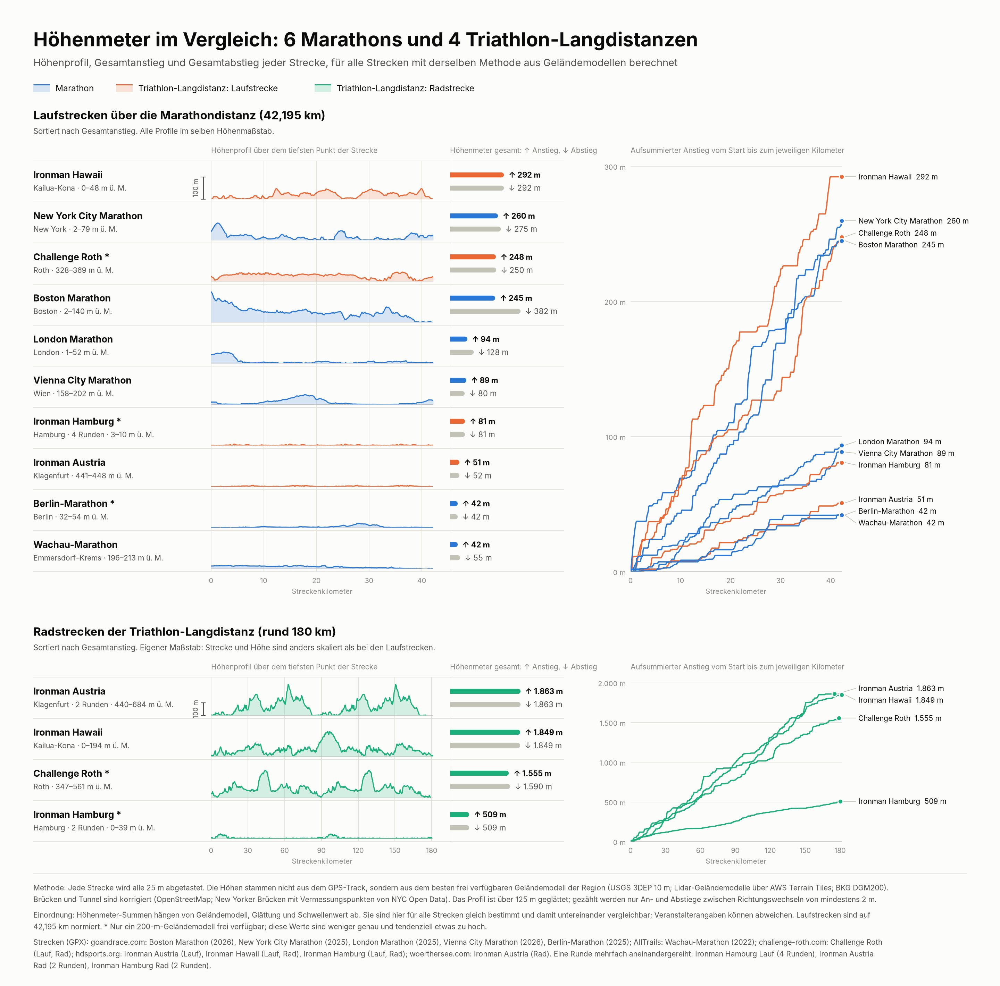

# GPX Elevation Analysis

[](https://github.com/Mw1n23/OverallAltitude/actions/workflows/python-ci.yml)

## Overview

This project analyzes GPX tracks and estimates total ascent/descent with a more realistic pipeline than a raw point-by-point sum of GPX altitude values.

The main script now:

- reads the GPX track,
- resamples it to a fixed horizontal spacing,
- replaces noisy GPX altitudes with terrain model elevations (open AWS Terrain Tiles by default, OpenTopoData as an alternative),
- caches external elevation lookups,
- optionally corrects sections on bridges and in tunnels,
- smooths the resulting profile and sums ascent and descent between significant reversals.

This avoids the classic problem where summing every GPS altitude jump produces an implausibly large overall ascent.

Technical background and method notes are documented in `docs/ELEVATION_METHOD_AND_SETUP.md`.

## Structure

- `OverallAltitude/Code/Track_analysis_05.py`: main script and analysis pipeline.
- `OverallAltitude/Code/race_comparison.py`: comparison of several race courses (see below).
- `OverallAltitude/Code/race_figure.py`: comparison figure.
- `OverallAltitude/Code/terrain_tiles.py`: elevation lookup from the open AWS Terrain Tiles.
- `OverallAltitude/Code/structure_correction.py`: bridge and tunnel correction of terrain elevations.
- `OverallAltitude/Code/track_types.py`: types shared by the modules.
- `OverallAltitude/Code/course_structures.py`: helper that lists bridge and tunnel sections of a course.
- `OverallAltitude/Code/fetch_race_tracks.py`: downloads the course tracks from their sources.
- `OverallAltitude/RawMaterial/`: sample GPX files.
- `OverallAltitude/RawMaterial/races/`: course manifest and bridge/tunnel data; the course tracks are downloaded into this folder.
- `Output/`: table and figure of the race comparison.
- `pyproject.toml` and `setup.py`: package metadata and install entry points.
- `requirements.txt`: convenience wrapper for `pip install -r requirements.txt`.
- `tests/`: standard-library unit tests.

## Clone and Install

Standard installation:

```bash
git clone https://github.com/Mw1n23/OverallAltitude.git
cd OverallAltitude
python -m venv .venv
source .venv/bin/activate
python -m pip install --upgrade pip
python -m pip install .[plot]
```

Development installation:

```bash
git clone https://github.com/Mw1n23/OverallAltitude.git
cd OverallAltitude
python -m venv .venv
source .venv/bin/activate
python -m pip install --upgrade pip
python -m pip install -e .[plot]
```

`matplotlib` is optional and is only needed for plotting. The core analysis itself uses the Python standard library.

## Run

Installed CLI:

```bash
overall-altitude --help
```

Module entry point:

```bash
python -m OverallAltitude --help
```

Default analysis run (Wachau marathon sample):

```bash
overall-altitude
```

The same run with the bridge and tunnel sections of the course corrected (the terrain model climbs over the Dürnstein tunnel, the course does not):

```bash
overall-altitude --course-id wachau_marathon
```

Explicit GPX input:

```bash
overall-altitude --gpx-file OverallAltitude/RawMaterial/WACHAUmarathon_Marathon.gpx
```

Force offline mode and use the embedded GPX elevations only:

```bash
overall-altitude --elevation-source gpx
```

Use the terrain tiles only (no GPX fallback):

```bash
overall-altitude --elevation-source terrain-tiles
```

Use an OpenTopoData dataset instead, for example the 200 m terrain model for Germany:

```bash
overall-altitude --elevation-source opentopodata --dataset bkg200m
```

Important options:

- `--resample-distance 25`: horizontal spacing in meters for the analysis profile.
- `--threshold 2`: minimum reversal in meters that separates a climb from a descent.
- `--dataset eudem25m,mapzen`: DEM dataset stack used with `--elevation-source opentopodata`.
- `--course-id <id>`: correct the bridge and tunnel sections listed for this course in `OverallAltitude/RawMaterial/races/structures.json`.
- `--cache-db ~/.cache/overall-altitude/elevation_cache.sqlite3`: SQLite cache for repeated runs; terrain tiles are cached in the folder next to it.
- `--plot / --no-plot`: enable or disable plotting.

## Race comparison

`overall-altitude-races` analyses the courses listed in `OverallAltitude/RawMaterial/races/races.json` (six marathons and four long-distance triathlons) with one method and writes a summary table and a comparison figure.



The course tracks are third-party material and are not part of the repository. Download them once, then run the comparison:

```bash
overall-altitude-fetch-tracks
overall-altitude-races --output-dir Output
```

The figure shows, per course, the elevation profile, total ascent and descent, and the cumulative ascent over the distance. Output files: `Output/race_comparison.csv`, `Output/race_comparison.png` and `Output/race_comparison.svg`. The table and the PNG figure of the current analysis are kept in the repository.

Important options:

- `--cache-dir ~/.cache/overall-altitude`: cache for elevation lookups and terrain tiles.
- `--no-plot`: write only the table (no `matplotlib` needed).

Method, data sources and limits are documented in `docs/RACE_COMPARISON.md`.

## Tests

```bash
python -m unittest discover -s tests -q
```

## GitHub workflow

- CI runs on push and pull request.
- Use `CONTRIBUTING.md` for the local development gate.
- Use `CHANGELOG.md` to track user-visible repository changes.
